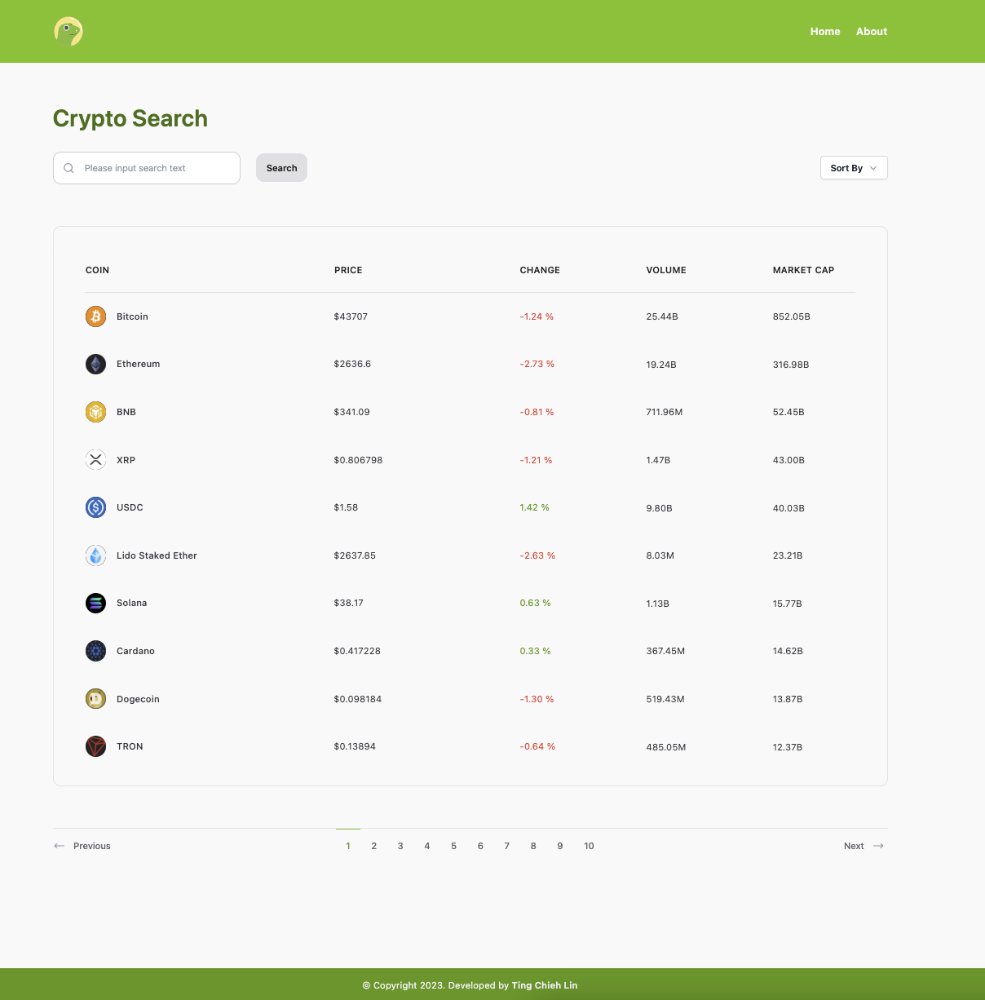

## Crypto Search App

Crypto Search App is a site where you can search and tracks the latest trends of currency



## Table of contents

- [Crypto Search App](#crypto-search-app)
- [Table of contents](#table-of-contents)
- [Demo](#demo)
- [Getting Started](#getting-started)
- [Tech I used](#tech-i-used)
- [Feature](#feature)
- [API](#api)
- [Design](#design)
- [Learn More](#learn-more)

## Demo

You can see my project on Vercel [Demo Link](https://crypto-search-arnp6ym5g-cooloojayoo.vercel.app)

## Getting Started

1. Install node_modules dependencies`npm install or yarn install`

2. Run the development server:

```bash
npm run dev
```

3.Run test

```bash
npm run test
or 
npm run test:watch  
# depending on whether you want to update anytime
```

Go to [Local Dev Link](http://localhost:3000)

## Tech I used

- React
- Next.js 13
- TailwindCSS
- React Query
- React Icon
- TailwildCSS UI
- Test Library (Jest)

## Feature

- Data handling
- Responsive Design
- Detail Page
- Unit Test
- Status of error handling, loading indicators, pagination, sorting, searching
- Deploy to Vercel

## API

CoinGecko RESTful API

- [API Documentation](https://www.coingecko.com/en/api/documentation)

## Design

Font

- [Montserrat](https://fonts.google.com/specimen/Montserrat)

Color

- [Lime & Zinc](https://tailwindcss.com/docs/customizing-colors)

## Learn More

To learn more about the project, take a look at the following resources:

- [NextJS set up with Jest, Testing Library and Cypress](https://medium.com/@Pavan_/nextjs-set-up-with-jest-testing-library-and-cypress-ac416510768f)

- [React Query Documentation](https://tanstack.com/query/v4/docs/react/quick-start)

- [Multiple type signatures for members, Union Types in TypeScript](https://stackoverflow.com/questions/18006045/multiple-type-signatures-for-members-union-types-in-typescript)

- [Sort immutable way](https://developer.mozilla.org/en-US/docs/Web/JavaScript/Reference/Global_Objects/Array/sort)

- [NextRouter was not mounted](https://nextjs.org/docs/messages/next-router-not-mounted)